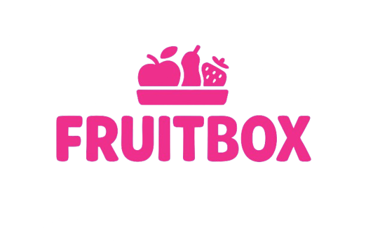

# FruitBox
# 🍎 FruitBox Flex — CSS Learning Game by Keshav Jindal

> 🎮 A fun, interactive way to learn CSS Flexbox — created as part of my portfolio for interviews and personal projects.

---

## 🚀 About the Project

**FruitBox** is a browser-based game that helps users understand how CSS Flexbox works through live interaction.  
The goal? Move the 🍎 **apple** into the 🧺 **basket** using the right CSS properties — like `justify-content`, `align-items`, and more.

Every level gets slightly trickier, making learning **visual, practical, and fun**!  
Built using **pure HTML, CSS, and JavaScript**, without any frameworks.

---

## 🧩 Features

✅ Interactive, real-time CSS editor  
✅ Level-based challenges  
✅ Animated UI with smooth transitions  
✅ Mobile responsive design  
✅ Custom Blynk-style aesthetic  
✅ Download Resume button (for my portfolio page)  
✅ Fully deployed on **Vercel**

---

## 🖥️ Tech Stack

| Category | Technology |
|-----------|-------------|
| **Frontend** | HTML5, CSS3, JavaScript (Vanilla) |
| **Design** | Flexbox, Custom Gradients, Glassmorphism |
| **Hosting** | [Vercel]([https://vercel.com/](https://fruit-box-seven.vercel.app/)) |
| **Version Control** | Git + GitHub |

---

## 📂 Folder Structure
FruitBox/
├──src/
│  ├── index.html # Home page
│  ├── pages/
│  ├── play.html # The interactive game page
│  ├── about.html # Portfolio/About page
│  │
│  ├── assets/
│  ├── css/ # All stylesheets
│  ├── js/ # All scripts
│  ├── media/ # Images, icons, resume, etc.
│
└── README.md

